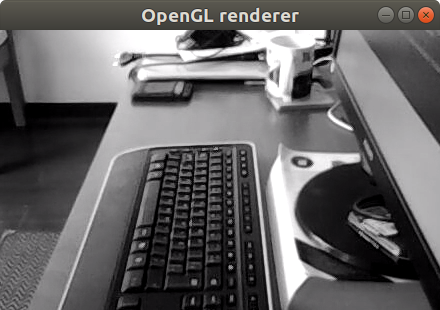
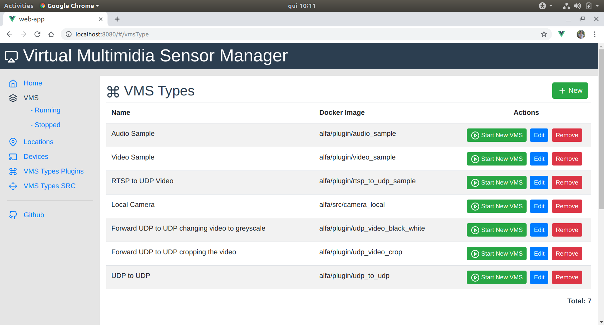

# ALFA a V-PRISM Implementation

<p align="center">
  
  
  
  
</p>

<p align="center">
  
</p>

## Introduction

Multimedia sensors have recently become a major data source, giving rise to the Internet of Multimedia Things. Since multimedia applications are usually latency-sensitive, data processing in the cloud is not always effective. A strategy to minimize delay is to process the streams closer to the data sources, exploiting the resources at the edge of the network. We propose V-PRISM, an architecture to virtualize multimedia sensors with components deployed and executed at the edge tier. V-PRISM can reduce the resource consumption of IoT devices, the network traffic, and the end-to-end delay while increasing the ROI (Return On Investment) for infrastructure providers.

You can read the full paper at https://ieeexplore.ieee.org/abstract/document/9221199

### How to Cite This Work 

<pre>
@INPROCEEDINGS{vprism2020,
  author={Anselmo Battisti and Débora Christina Muchaluat Saade and Flavia Coimbra Delicato},
  booktitle={2020 IEEE 6th World Forum on Internet of Things (WF-IoT)}, 
  title={{V-PRISM}: An Edge-Based IoT Architecture to Virtualize Multimedia Sensors}, 
  year={2020},
  volume={},
  number={},
  pages={}
}
</pre>

## What is V-PRISM?

V-PRISM is an architecture to create VMS (Virtual Multimedia Sensors). They are used to improve features from real multimedia devices. A VMS Camera can be used to deliver images in many formats that the physical hardware device can't, or improve features that the device doesn't have. For example, the image below was generated by colour stream data.

## What is ALFA?

ALFA is a management tool for creating an infrastructure to virtualize multimedia sensors (cameras and microphones). ALFA implements the V-PRISM architecture. The ideas behind this tool are: a single camera can be the source of a variety of VMS that process, manipulate, and extract data from the multimedia stream and delivery it for an application that started these plugins remotely via FIWARE.



The picture above was generated by a VMS that receives a multimedia stream from a full RGB device. VMS can be programable to deliver data in any format.

The picture above show the web client used to manage the VMS and the VD of an ALFA instalatino.



# Installation

*Note:*  If you are installing ALFA in a Raspberry, you will need to make some changes in environments variables. Follow this steps https://github.com/midiacom/alfa/wiki/Install-in-a-Raspberry-3

For more information consult the WIKI https://github.com/midiacom/alfa/wiki

## NPM
You will need to install NPM in the machine that will run the api.

In a ubuntu environment only run 

```
sudo apt get install npm
```

## Docker and Docker Compose

### Docker 

You need a host with docker and docker-composed installed AND the Docker <strong>API MUST BE </strong> enabled! 

To install docker follow these steps:

https://docs.docker.com/install/linux/docker-ce/ubuntu/

### To enable the API do it

- 1 - Navigate to /lib/systemd/system in your terminal and open docker.service file 
```
sudo vi /lib/systemd/system/docker.service
```
- 2 - Find the line which starts with  ExecStart and replace to 
```
ExecStart=/usr/bin/dockerd -H=fd:// -H=tcp://0.0.0.0:2375
```
- 3 - Save the Modified File
- 4 - Reload the docker daemon: 
```
sudo systemctl daemon-reload
```
- 5 - Restart the container: 
```
sudo service docker restart
```
- 6 - Rest if it is working by using this command if everything is fine below command should return a JSON
```
curl http://localhost:2375/images/json
```

## Important!
Be default the Docker API to port: 2375 if you need another port then change the configuration at api/config/dev.env

## Docker Network Overlay 

```
docker network create --driver overlay --attachable alfa_swarm_overlay1
```

### Docker Compose

To install docker-compose follow these steps.

https://docs.docker.com/compose/install/


## Download the repository 

* Create a new folder to host all the ALFA files;
* Inside this folder run 
```
git clone git@github.com:midiacom/alfa.git .
```

## Build Virtual Devices and the VMS

Before using the system, you need to build the Dockerfiles of all SRC and VMS. To do it follow the above steps.

* Access the folder virtual-nodes
* Run the command 

```
sudo ./build_all.sh
```

Or if you want to install only one VMS or VD you can run. 

```
sudo ./install.sh
```

**tip:** if you need to kill all the VMS and SRC you can run **./kill_all_running_src_and_plugins.sh** at this folder

## Build the Web Client

* Install the nodejs packages in web-app and api folder
```
cd web-app
sudo npm install
npm run build
```

## Build the API

You will need the docker and docker-compose installed in your machine.

access the folder API and run 

```
cd api
sudo npm install
```

## Run (API, Web Client, Mosquito MQTT and MongoDB)

To run all the ALFA requirements at the root folder run. 

```
sudo docker-compose build
sudo docker-compose up
```

Now access the URL http://localhost:8081 and import the necessary data for using V-PRISM.

## To Developers 

## Run the Web Client as a Dev

If you are running at development mode, you will need nodejs and npm

Access, the folder web-app then run the web interface.

``` 
npm install
npm run serve
``` 

### View Videos in VLC

1 - Create a play.sdp file with the content

```
v=0
c=IN IP4 127.0.0.1
m=video 50000 RTP/AVP 96
a=rtpmap:96 H264/90000
a=fmtp:96 media=video; clock-rate=90000; encoding-name=H264; sprop-parameter-sets=Z2QAFKzZQUH7AWoMAgtKAAADAAIAAAMAeR4oUyw\=\,aOvssiw\=
```

2 - vlc play.sdp

### Gstreamer Packages for development

Install GStreamer on Ubuntu or Debian
Run the following command:

```
apt-get install libgstreamer1.0-0 gstreamer1.0-plugins-base gstreamer1.0-plugins-good gstreamer1.0-plugins-bad gstreamer1.0-plugins-ugly gstreamer1.0-libav gstreamer1.0-doc gstreamer1.0-tools gstreamer1.0-x gstreamer1.0-alsa gstreamer1.0-gl gstreamer1.0-gtk3 gstreamer1.0-qt5 gstreamer1.0-pulseaudio gstreamer1.0-libav
```

More details here 
https://gstreamer.freedesktop.org/documentation/installing/on-linux.html?gi-language=c

# Understanding ALFA

## Supported SRC Types

* Video Sample Test: you can create a device that generate the "samples" videos like bars, running balls, snow;
* Audio Sample Test: send a stream of a classical music to test audio;
* Local USB cameras devices: connect to a USB local câmera
* RTSP devices: connect to a device that uses RTSP protocol
* Local Mic devices: connect to a mic device

## Supported VMS Types

* UDP to UDP: forward UDP packages, independently of its content
* Crop video and send to UDP: cut (top, middle, right and left of a video)
* Greyscale and send to UDP: convert a color video into a greyscale one
* Noise Detection: you can define the noise level, and the result will be sent to an MQTT server
* Video Merge: grab two video streams and convert it into only one video stream

## Important things to do

* Login and password feature
* Create a way do remove gst_bin_remove_many elements from SRC queue (when stop the VMS)
* Test if using TCP instead of UDP is a better way to communicate VMS and SRC. In this scenario VMS will be the client and SRC will be the server and the bind function will call the VMS to start a new TCP communication with the SRC.
* The binded to column needs to be changed because now a vms can be binded to two or more SRC

# Team 

* Anselmo Luiz Éden Battisti - http://lattes.cnpq.br/6937214674204474
* Flávia Coimbra Delicato - http://lattes.cnpq.br/5386282151810710
* Debora Christina Muchaluat Saade - http://lattes.cnpq.br/2448703093928632

# Video Tutorials (in Portuguese)

## Quick demo

https://www.youtube.com/watch?v=GeKvoEdtYDM

## More detailed demo 
https://www.youtube.com/watch?v=dxg4b4nKwgo

## Introdução ao gsteramer
https://www.youtube.com/watch?v=KLhZmEGeqHk

## Criando um programa em C usando gstreamer e rodando em um docker container
https://www.youtube.com/watch?v=GlnXkJnsMGk&feature=youtu.be

# Special Thanks To 

* VUEJS https://vuejs.org/
* Bootstrap VUE https://bootstrap-vue.js.org/
* Lib icons: https://feathericons.com/
* The logo was created by https://www.flaticon.com/free-icon/refraction_308781#term=prism&page=1&position=33

# Important Link

* https://embeddedartistry.com/blog/2018/2/22/generating-gstreamer-pipeline-graphs how to plot dot files from GStreamer pipelines

* http://tordwessman.blogspot.com/2013/06/gstreamer-tee-code-example.html
Example dynamic pad

* https://stackoverflow.com/questions/45700653/can-my-docker-container-app-access-the-hosts-microphone-and-speaker-mac-wind/48795232 Map a mic inside a docker container

# VS Code

code --disable-gpu --no-xshm

# ACKNOWLEDGMENT

This  work  is  partially  supported  by  São  Paulo  Research Foundation – FAPESP


<p align="center">
  
</p>
